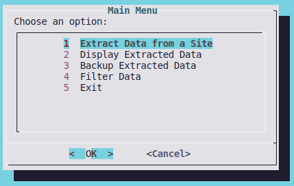
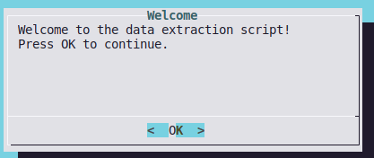
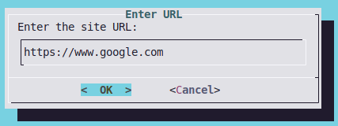
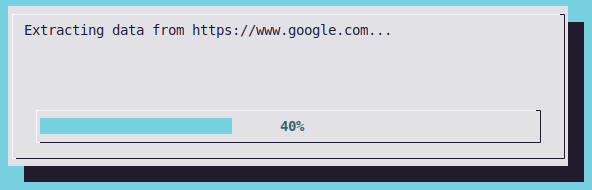
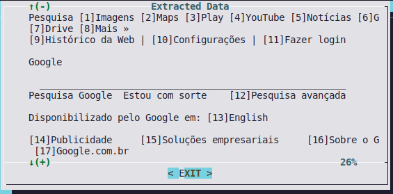
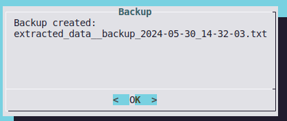
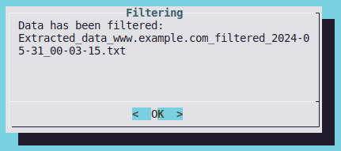

# Data Extraction Script

## Overview

This script automates the process of extracting data from a website using the `lynx` browser and provides an interactive interface using `dialog`. It installs and configures `lynx`, prompts the user for a URL, extracts data from the specified website, and displays the extracted data. The script also includes features such as URL verification, progress bar during data extraction, filtering of the extracted data, and backup creation.

## What is Lynx?

Lynx is a highly configurable text-based web browser for use on cursor-addressable character cell terminals. It is known for its efficiency and speed, as it can render web pages quickly in a text-only format, making it ideal for environments where graphical browsers are not practical. Lynx can also be used in scripts to programmatically interact with web pages and extract data.

## Script Functions

### Global Variables

- `SITE_URL`: Default URL of the website to extract data from.
- `EXTRACTED_DATA`: Filename to save the extracted data.
- `epochs`: Number of iterations for the progress bar during data extraction.

### Functions

#### `install_lynx()`

Checks if `lynx` is installed on the system. If not, it installs `lynx` using the package manager.

#### `initial_screen()`

Displays a welcome message using `dialog`.

#### `main_menu()`

Displays the main menu, allowing the user to choose actions such as extracting data, displaying extracted data, creating a backup, or filtering data.

#### `get_url()`

Prompts the user to enter the URL of the website to extract data from using `dialog`.

#### `extract_data()`

Uses `lynx` to extract data from the specified URL and saves it to a file, displaying a progress bar during the extraction process.

#### `display_data()`

Displays the extracted data using `dialog`.

#### `backup()`

Creates a backup of the extracted data with a timestamp and the name of the website.

#### `filter_data()`

Filters and transforms the extracted data, saving the filtered data to a new file. It extracts specific patterns from the data, such as text preceded by numbers within square brackets. Additionally, it extracts and appends any URLs found in the extracted data to the filtered data file.

### Script Execution

1. `initial_screen`: Displays the initial welcome message.
2. `install_lynx`: Ensures `lynx` is installed.
3. `main_menu`: Presents the main menu for user interaction.
4. Cleanup: Removes the temporary file and displays an exit message.

## Conclusion

This script simplifies the process of extracting data from a website using `lynx` and provides a user-friendly interface with `dialog`. It ensures that necessary tools are installed, allows users to specify the target website, and displays the extracted data in an organized manner. With the new filtering feature, users can extract specific patterns from the data and also extract any URLs referenced in the data. This script can be further expanded and customized to meet specific data extraction needs.
